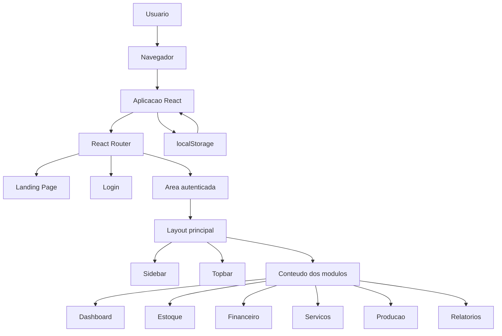
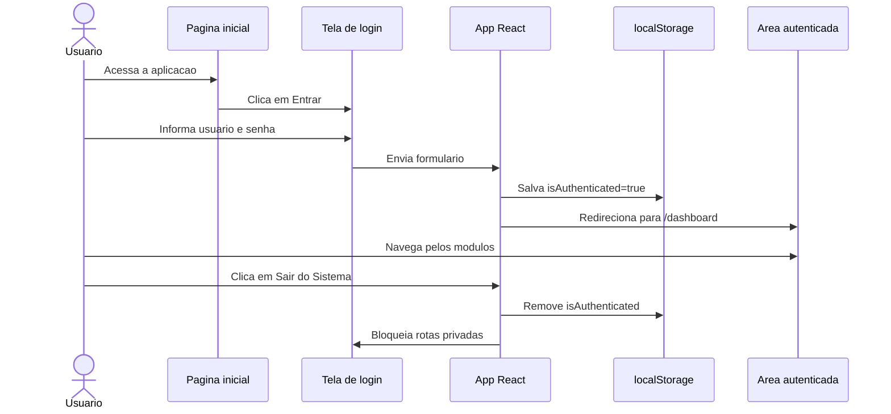
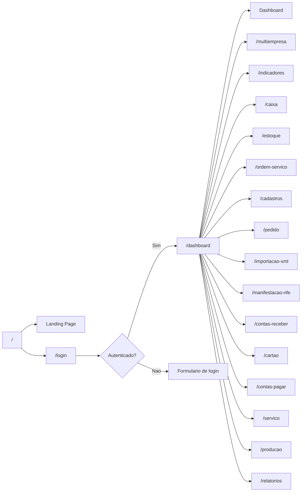
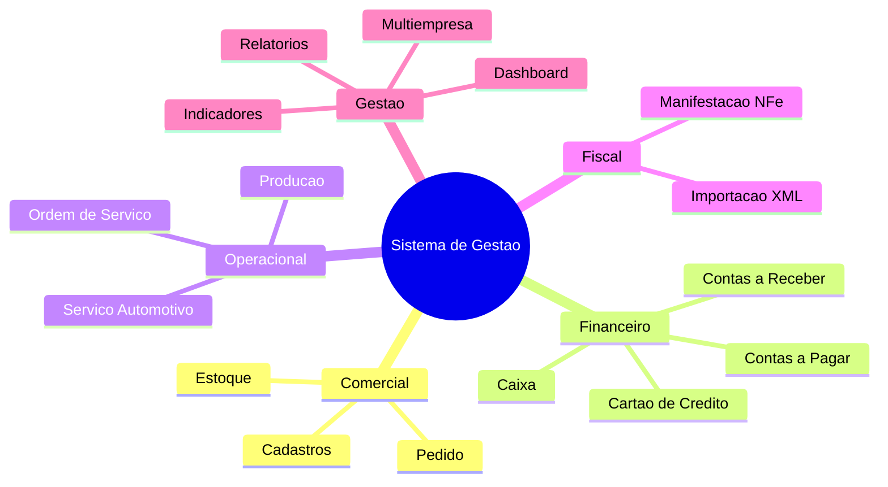

# Sistema de Gestao Empresarial


Sistema web de gestao empresarial desenvolvido com React, TypeScript, Vite e Tailwind CSS. A aplicacao apresenta uma landing page comercial, tela de login e um painel administrativo com modulos para estoque, financeiro, vendas, servicos, producao, relatorios, indicadores e gestao multiempresa.

> Observacao: o projeto atual e uma aplicacao frontend. A autenticacao e demonstrativa, armazenada no `localStorage`, e qualquer usuario/senha preenchidos permitem acessar o painel.

## Indice

- [Sobre o projeto](#sobre-o-projeto)
- [Funcionalidades](#funcionalidades)
- [Tecnologias](#tecnologias)
- [Arquitetura](#arquitetura)
- [Fluxo de autenticacao](#fluxo-de-autenticacao)
- [Mapa de rotas](#mapa-de-rotas)
- [Como executar](#como-executar)
- [Scripts disponiveis](#scripts-disponiveis)
- [Estrutura de pastas](#estrutura-de-pastas)
- [Build e deploy](#build-e-deploy)
- [Possiveis melhorias](#possiveis-melhorias)

## Sobre o projeto

O Sistema de Gestao Empresarial foi criado para simular uma plataforma integrada para empresas que precisam controlar processos operacionais e financeiros em uma unica interface. A aplicacao possui uma pagina inicial com apresentacao do produto, uma tela de login e um dashboard com navegacao lateral para os principais modulos do sistema.

O layout usa uma identidade visual com contraste entre preto, branco e tons de laranja, priorizando cards, botoes de acao rapida, indicadores e uma experiencia visual moderna para sistemas administrativos.

## Funcionalidades

- Landing page com apresentacao do sistema, beneficios, estatisticas e chamada para acesso.
- Login demonstrativo com persistencia de sessao via `localStorage`.
- Rotas protegidas para impedir acesso ao painel sem login.
- Dashboard com indicadores principais e cards de acesso aos modulos.
- Sidebar recolhivel com menu completo do sistema.
- Barra superior com campo de busca, notificacao e identificacao do usuario.
- Tratamento global de erros com `ErrorBoundary`.
- Interface responsiva baseada em Tailwind CSS.

### Modulos disponiveis

- Dashboard
- Multiempresa
- Indicadores
- Caixa
- Estoque
- Ordem de Servico
- Cadastros
- Pedido
- Importacao XML
- Manifestacao NFe
- Contas a Receber
- Cartao de Credito
- Contas a Pagar
- Servico Automotivo
- Producao
- Relatorios

## Tecnologias

- **React 18** para construcao da interface.
- **TypeScript** para tipagem estatica.
- **Vite** como ferramenta de desenvolvimento e build.
- **React Router DOM** para navegacao entre paginas.
- **Tailwind CSS** para estilizar a interface.
- **Lucide React** para icones.
- **PostCSS** e **Autoprefixer** para processamento de CSS.

## Arquitetura



## Fluxo de autenticacao



## Mapa de rotas



## Organizacao dos modulos



## Como executar

### Pre-requisitos

Antes de comecar, instale:

- Node.js 18 ou superior
- npm
- Git

### Passo a passo

Clone o repositorio:

```bash
git clone https://github.com/seu-usuario/seu-repositorio.git
```

Acesse a pasta do projeto:

```bash
cd seu-repositorio
```

Instale as dependencias:

```bash
npm install
```

Execute o servidor de desenvolvimento:

```bash
npm run dev
```

Acesse no navegador:

```text
http://localhost:5173
```

## Scripts disponiveis

### `npm run dev`

Inicia o servidor de desenvolvimento do Vite.

### `npm run build`

Gera a versao de producao na pasta `dist`.

### `npm run preview`

Executa uma pre-visualizacao local da build de producao.

## Estrutura de pastas

```text
.
├── index.html
├── package.json
├── postcss.config.js
├── tailwind.config.js
├── tsconfig.json
├── tsconfig.node.json
├── vite.config.ts
└── src
    ├── App.css
    ├── App.tsx
    ├── ErrorBoundary.tsx
    ├── index.css
    ├── main.tsx
    └── vite-env.d.ts
```

### Principais arquivos

- `src/main.tsx`: ponto de entrada da aplicacao React.
- `src/App.tsx`: rotas, autenticacao, landing page, layout principal e modulos.
- `src/ErrorBoundary.tsx`: componente para capturar erros de renderizacao.
- `src/index.css`: configuracao do Tailwind, reset global, scrollbar e animacoes.
- `src/App.css`: estilos especificos complementares.
- `vite.config.ts`: configuracao do Vite e servidor local.

## Build e deploy

Para gerar os arquivos finais:

```bash
npm run build
```

Os arquivos serao criados na pasta:

```text
dist
```

Depois disso, a aplicacao pode ser publicada em servicos como:

- Vercel
- Netlify
- GitHub Pages
- Render
- Servidor proprio com Nginx ou Apache

Para testar a build localmente:

```bash
npm run preview
```

## Possiveis melhorias

- Integrar uma API backend para login real, usuarios, permissoes e dados persistentes.
- Adicionar banco de dados para produtos, clientes, fornecedores, pedidos e financeiro.
- Criar componentes reutilizaveis para cards, botoes, listas e paginas de modulo.
- Implementar graficos reais usando `recharts`.
- Adicionar testes automatizados.
- Criar controle de permissoes por usuario e empresa.
- Adicionar upload e leitura real de XML de notas fiscais.
- Implementar tema claro/escuro.
- Melhorar acessibilidade com foco visivel, labels e navegacao por teclado.

## Licenca

Este projeto pode ser usado como base de estudo, portfolio ou evolucao para um sistema empresarial completo.

---

Desenvolvido para demonstrar uma interface moderna de gestao empresarial com React, TypeScript, Vite e Tailwind CSS.
